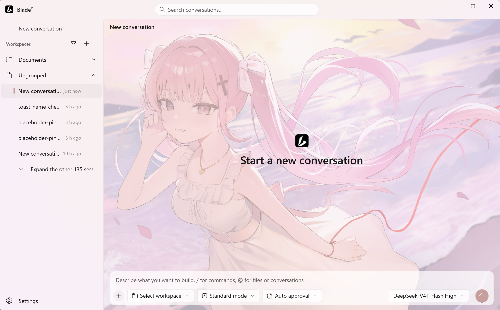

<div align="center">


# Blade²

</div>

dsh 智能体内核的原生 WinUI 3 桌面壳。无 Electron，无 WebView——纯 XAML 界面，直连内核 RPC。一个自包含 MSIX，开箱即用。

```
  ● 打开 Blade²
  │
  ● 内置内核在 127.0.0.1 启动（token 握手）
  │
  ● 原生 WinUI · 聊天 · 审批 · 设置 · 宠物
  ✓ 就绪
```

**给 dsh 的 Windows 应用。不是浏览器窗口。**

[English](README.md) · v0.8.1 · Windows 10 19041+ · x64 · .NET 8 · WinUI 3

> **状态** · Windows 壳 Rust 重构中 · macOS 版开发中


---

## 相对官方桌面端

- **原生界面** — 无 WebView。WinUI 3 自绘，原生的 Windows 应用
- **单包安装** — 内核与运行时打进同一个 MSIX，无需另装依赖
- **数据隔离** — 自有数据目录，不碰 CLI 的 `~/.dsh`
- **系统融合** — 支持系统托盘、系统深浅色实时跟随、Mica / 亚克力材质皮肤、系统通知
- **桌面宠物** — 兼容 Codex 宠物包；自动导入 Codex 已有的宠物，支持一键安装新宠
- **壁纸皮肤** — 支持自定义图片和视频作为背景皮肤，自动兼容 Wallpaper Engine 动态桌面壁纸
- **细腻交互** — 轮次刻度栏、图片灯箱、上下文环、撤回本轮、片段搜索
- **使用统计** — 活跃热力图、当前/最长连续天数、每日 Token 趋势、按模型用量占比，时间范围可切换
- **开箱即用** — 自带自动审批、browser-use、电脑控制、记忆 MCP



## 工作原理

- 壳包裹**内核**，而不是 Web UI——升级 dsh = 换内核树（`check-dsh-contract.ps1` 校验契约）。
- `Kernel/`（裁剪 dsh + `node.exe`）随同一个 MSIX 发行。不依赖系统 Node，不要求全局 npm，不带 Electron。
- 全部状态落在 `%LOCALAPPDATA%\Blade2`，与 CLI 的 `~/.dsh` 彻底分开。
- 内核绑定 `127.0.0.1` 随机端口，外加进程级 launch token——包内不带凭据文件。

关键源码：[`Dsh/DshKernelHost.cs`](Dsh/DshKernelHost.cs) · [`Dsh/DshRpcClient.cs`](Dsh/DshRpcClient.cs) · [`Dsh/DshPetClient.cs`](Dsh/DshPetClient.cs) · [`MainWindow.xaml.cs`](MainWindow.xaml.cs)

## 安装

从 [Releases](../../releases) 下载 `Blade2_<版本>_x64.msix`（约 140 MB，自包含）。

1. 先信任自签证书一次（导入 *Trusted People*），否则 `Add-AppxPackage` 报 `0x800B0109`。
2. 双击 MSIX，或执行 `Add-AppxPackage <msix>`。需要 Windows 10 19041+ x64。

已在用 dsh CLI？把 `~/.dsh/.credentials.yaml` 复制到 `%LOCALAPPDATA%\Blade2\`——不会自动迁移任何凭据。

## 从源码构建

前置：Windows x64、[.NET 8 SDK](https://dotnet.microsoft.com/)、Visual Studio 2022（仅打包时用它的 MSBuild）。

```sh
dotnet run                # 开发形态；无内置内核时回退系统 dsh.cmd
pwsh -File run-dev.ps1    # 清理残留进程并启动 Debug 构建
```

Release MSIX 打包必须用 VS 的 MSBuild——`dotnet build` 不产 MSIX。版本号在 `Blade2.csproj` 的 `<Version>` 与 `Package.appxmanifest` Identity **两处同改**。

```powershell
msbuild Blade2.csproj /p:Configuration=Release /p:Platform=x64 `
  /p:AppxPackageDir=C:/AppxPkgs/ /p:GenerateAppxPackageOnBuild=true /p:AppxBundle=Never
signtool sign /fd SHA256 /sha1 <thumbprint> <msix>
Add-AppxPackage <msix>    # 安装前先杀壳进程与内置 node.exe（0x80073D02）
```

辅助脚本：`build-0800.ps1`（一键 Release 打包）· `install-0800.ps1`（杀进程、验签、安装）· `check-dsh-contract.ps1 -CliOnly`。

> 包身份为 `Blade2`（`²` 是包标识非法字符，上标只出现在显示名）。Publisher 保持 `CN=DshWinUI`。Git Bash 里先 `export MSYS_NO_PATHCONV=1`。

## 数据与调试

- 数据目录：`%LOCALAPPDATA%\Blade2`（会话、设置、`shell.json`、皮肤、`pets\`）
- journal：`...\sessions\<ws>\<session>\session.v3.jsonl.zstd`
- 未处理异常：`%TEMP%\blade2_unhandled.txt`
- UI 自动化：**UIA only**

无自动更新——覆盖安装新版 MSIX 即可。

## 平台状态

- **Windows** — 已发布 .NET / WinUI 3 壳；Rust 重构进行中。
- **macOS** — 开发中。见 [`mac/README.md`](mac/README.md)。

## 贡献

欢迎 bug 修复与文档改进。设计说明与内核契约见 [`docs/DESIGN.zh.md`](docs/DESIGN.zh.md)。

## 许可

- [dsh / DeepSeek Harness](https://github.com/deepseek-ai/deepseek-harness)——以裁剪形态随包发行，[MIT](Kernel/dsh/LICENSE)（© 2026 DeepSeek）。
- 壳源码：[MIT](LICENSE)（© 2026 SAKUSORA）。
